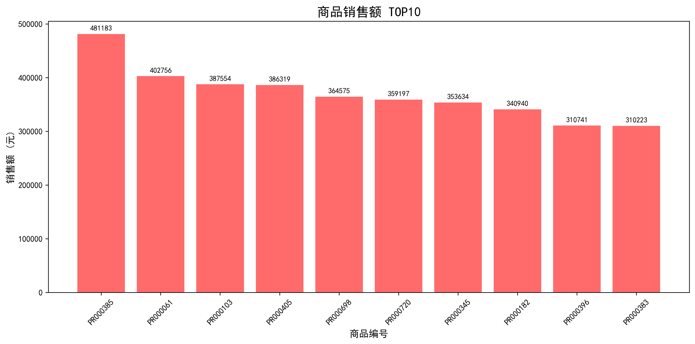
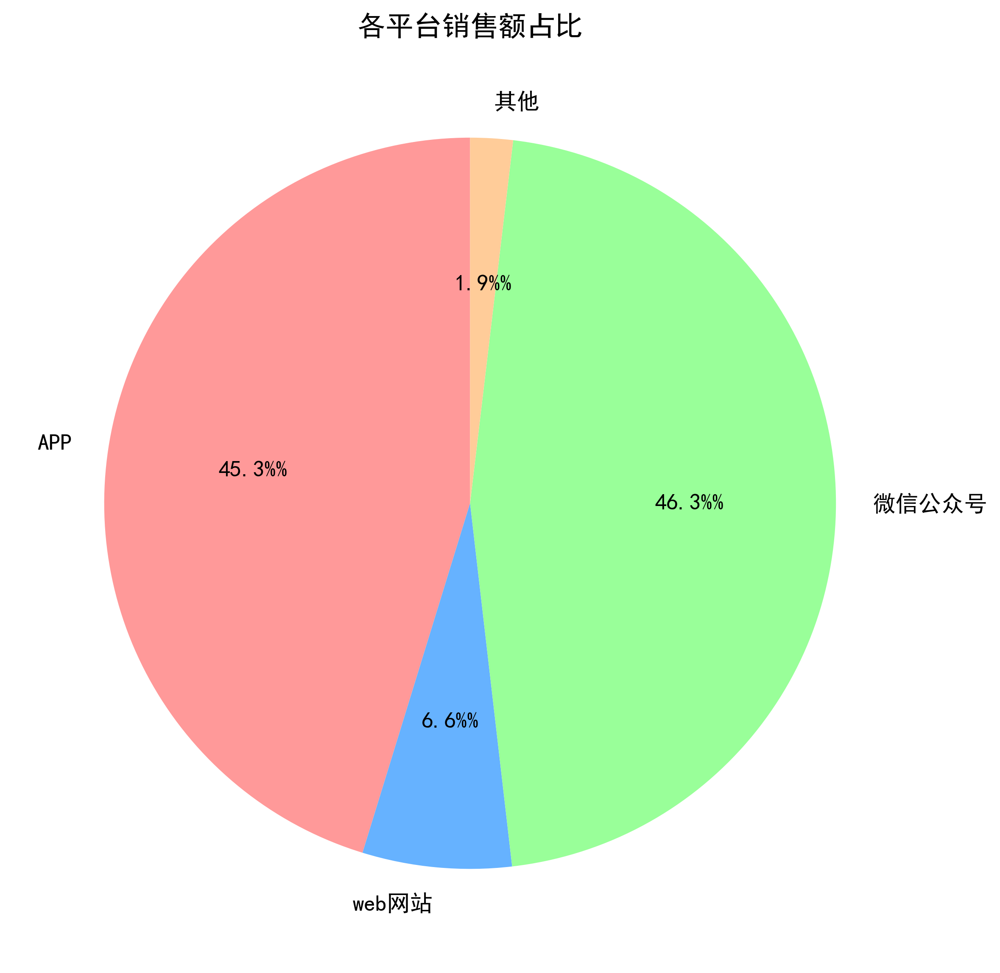
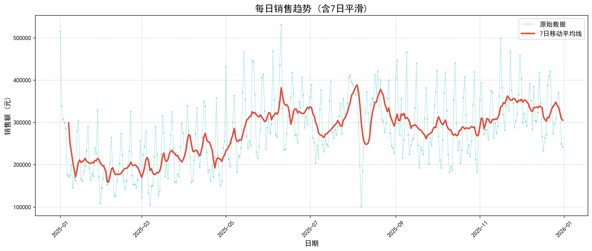
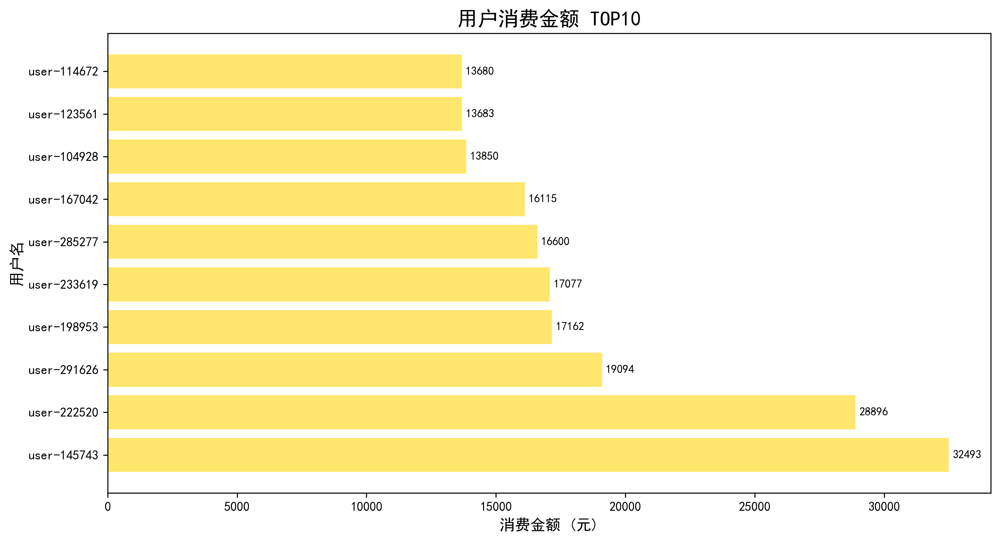
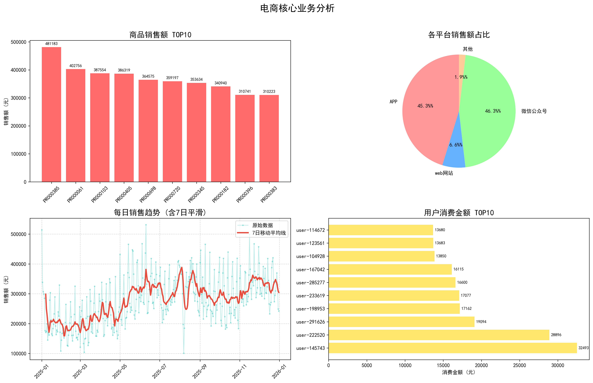
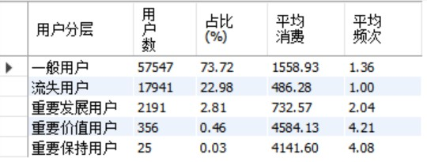

# 🛒 电商订单数据分析项目

## 📌 项目简介

基于 **10万+ 条电商真实订单数据**，独立完成从数据清洗、特征工程到多维分析与可视化的完整链路。通过 Pandas 进行数据聚合与时间序列处理，使用 Matplotlib 输出业务看板，并利用 MySQL 进行复杂 SQL 分析与用户留存/分层挖掘，为运营策略提供数据支撑。

---

## 🛠️ 技术栈

| 类别 | 技术 |
|------|------|
| **语言** | Python 3.8+, SQL |
| **数据处理** | pandas, numpy |
| **数据库** | MySQL |
| **可视化** | matplotlib, seaborn |
| **开发环境** | Jupyter Notebook |
| **版本控制** | Git |

**数据处理流程**：
```
数据清洗 → 特征提取 → 多维聚合 → 趋势平滑 → 可视化输出
                                                        ↓
                                         MySQL导入 → SQL高级分析 → RFM分层
```

---

## 📊 数据分析内容

### 1. 数据清洗 (`01_data_cleaning.ipynb`)
- 读取原始 Excel 数据
- 处理缺失值、异常值
- 数据类型转换
- 生成清洗后数据集 `cleaned_orders.csv`

### 2. 销售额分析 (`02_sales_analysis.ipynb`)
- 总销售额统计
- 各平台销售额对比
- 订单数量与金额关系

### 3. 时间维度分析 (`03_time_analysis.ipynb`)
- **每日销售趋势**：追踪全年日销变化，发现销售周期规律
- **每小时订单分布**：分析用户下单高峰期，优化运营策略
- **星期几订单分布**：识别周末/工作日消费差异

### 4. 商品与用户分析 (`04_product_user_analysis.ipynb`)
- **商品销售额 TOP10**：识别爆款商品，建立库存预警机制
- **用户消费 TOP10**：挖掘高价值用户，支撑会员营销

### 5. 可视化看板 (`05_visualization.ipynb`)
- 4 张独立分析图 + 1 张四合一总览图
- 柱状图带数值标签
- 7日移动平均线平滑处理
- 饼图占比优化（合并小渠道）

### 6. SQL 高级分析 (`sql/`)
- **留存分析**：次日留存率、7日/30日留存率，衡量用户粘性
- **RFM 用户分层**：基于 Recency（最近消费）、Frequency（消费频次）、Monetary（消费金额）三维度划分用户价值层级
- **用户群体分类**：重要价值用户、重要发展用户、重要保持用户、流失用户、一般用户

---

## 📁 项目结构

```
ecommerce_analysis/
├── data/
│   ├── datas.xlsx               # 原始订单数据（敏感数据，不上传）
│   └── cleaned_orders.csv       # 清洗后数据 (102,318 条)
├── notebook/
│   ├── 01_data_cleaning.ipynb   # 数据清洗
│   ├── 02_sales_analysis.ipynb  # 销售额分析
│   ├── 03_time_analysis.ipynb   # 时间维度分析
│   ├── 04_product_user_analysis.ipynb  # 商品用户分析
│   └── 05_visualization.ipynb   # 可视化看板
├── sql/
│   ├── 01_create_table.sql      # 建库建表语句
│   ├── 02_import_data.sql       # CSV 数据导入
│   └── 03_analysis.sql          # 留存分析 + RFM 分层
├── output/
│   ├── 03_daily_sales.csv
│   ├── 03_hourly_orders.csv
│   ├── 03_weekday_sales.csv
│   ├── 04_product_orders.csv
│   ├── 04_product_sales.csv
│   ├── 04_user_spending.csv
│   ├── 05_01_商品销售额TOP10.png
│   ├── 05_02_平台销售额占比.png
│   ├── 05_03_每日销售趋势.png
│   ├── 05_04_用户消费TOP10.png
│   ├── 05_核心业务分析图.png
│   ├── 05_核心业务分析图_四合一.png
│   └── rfm_user_segmentation.png.jpg  # RFM 用户分层图
├── .gitignore
├── README.md
└── requirements.txt
```

---

## 🎯 核心业务洞察

### 1️⃣ 头部商品效应显著
- **TOP10 商品**单款销售额均超 **30 万元**
- 最高达 **48 万元**
- **建议**：建立爆款库存预警与流量倾斜机制

### 2️⃣ 渠道双极化格局
| 渠道 | 占比 |
|------|------|
| APP | 45.3% |
| 微信公众号 | 46.3% |
| Web网站 | 6.6% |
| 其他 | 1.9% |

- `APP` 与 `微信公众号` 贡献超 **90%** 销售额
- **建议**：收缩低效渠道投入，聚焦移动端转化

### 3️⃣ 销售呈稳健上升趋势
- 原始日销波动较大（受周末/促销节点影响）
- **7日移动平均线** 显示全年销售额从 **20万** 逐步攀升至 **30万+** 区间
- 整体增长健康

### 4️⃣ 高价值用户池明确
- **TOP10 用户**累计消费超 **18 万元**
- 单客最高达 **3.2 万元**
- 具备典型**"二八定律"**特征
- **建议**：搭建会员分层与精准营销体系

### 5️⃣ 用户留存与分层（SQL 分析结果）
- **RFM 模型**：将用户分为 5 个层级（重要价值、重要发展、重要保持、流失、一般用户）
- 平均每用户消费 1.31 单，客单价约 1,303 元
- 大部分用户为**一次性消费**，复购率有较大提升空间
- **建议**：针对「重要保持用户」做唤醒营销，针对「重要价值用户」搭建 VIP 会员体系

---

## 📈 可视化成果

### Python 可视化

| 图表 | 说明 |
|------|------|
|  | 商品销售排行榜，带数值标签 |
|  | 渠道占比饼图，无小数值干扰 |
|  | 原始数据+7日均线，看清大方向 |
|  | 高价值用户挖掘 |
|  | 业务看板总览 |

### SQL 分析结果

| 图表 | 说明 |
|------|------|
|  | RFM 模型用户分层：重要价值/重要发展/重要保持/流失/一般用户分布 |

---

## 🚀 运行方式

```bash
# 1. 克隆项目
git clone <仓库地址>
cd ecommerce_analysis

# 2. 安装依赖
pip install -r requirements.txt

# 3. 运行 Jupyter Notebook
jupyter notebook

# 4. 按顺序打开并运行 notebook
# 01_data_cleaning.ipynb
# 02_sales_analysis.ipynb
# 03_time_analysis.ipynb
# 04_product_user_analysis.ipynb
# 05_visualization.ipynb

# 5. SQL 分析（需 MySQL 环境）
# 依次执行 sql/ 文件夹中的脚本
# 01_create_table.sql → 02_import_data.sql → 03_analysis.sql
```

---

## 📝 依赖清单

```
pandas>=1.3.0
matplotlib>=3.4.0
numpy>=1.21.0
openpyxl>=3.0.0
pymysql
```

---

> 💡 **项目亮点**：完整的数据分析流程（Python + SQL）、工程化的文件命名、规范的 Git 提交、用户留存与 RFM 分层分析、清晰的业务洞察输出。
